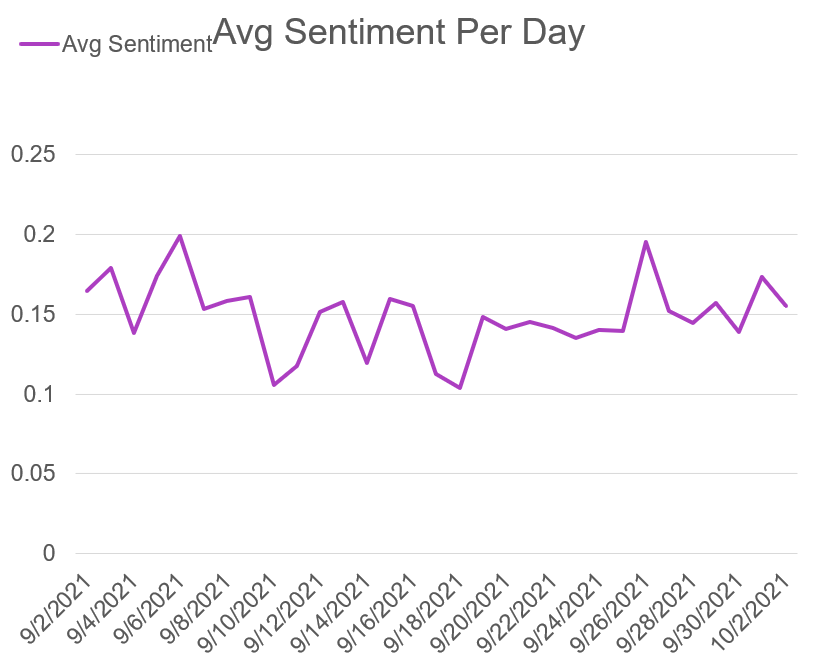

# MSDS692 Data Science Practicum I

# Warning: this project includes public tweets from twitter and may include offensive content.
## Can the sentiment of tweets predict a stock’s price?</h2>




This is a two part project, part 1, this part; is about collecting and scoring the tweets.

Part two involves using machine learning to discover if tweet sentiment can predict and factor of stock price. 

## Part 1

30 Days worth of tweets were collected that mentioned the APPL stock symbol. Those tweets were then scored between -1 and 1 depending on their sentiment. 

## Instructions to run these files</h2>

Run all files from inside the /src folder.

Install requirements
```shell
pip install -r requirements.txt
```

Copy your keys and tokens into scrape_tweets.py and then you can run it. It will collect 10's of thousand of tweets, so only do this if you are ready to use up much of your monthly rate allocation!

Adjust query and label as you see fit. label is the twitter dev environment label you want to use. This is something you create in the developer portal 

The tweets will be written out to a file=> scraped-tweets.csv I have include a one day sample

### There is an issue with scrape_tweets.py that I have not patched yet!! It will incorrectly double escape all unicode characters, so beware. There will be manual processing required if you use it as is.</h3>

```shell
python scrape_tweets.py
```

The only way I could figure out how to fix the double escaped unicode characters issue was to take the output file and make a script file from it. 

In reencode.py replace the triple quoted code block with the content of the scraped-tweets.csv file. I have included all of my tweets as an example. You may have to make some manual fixes, I did, to remove some character sequences that could cause problems. I just ran reencode.py over and over then fixed the errors as they came. I also manually removed all newlines and other control characters from scraped-tweets.csv. I intend to patch this issue in future versions. 

This will produce reencoded_tweets.csv which should have one tweet per line. I have included the file I used.

```shell
python reencode.py
```

Run score_tweets.py to produce a new file that gives the sentiment score for each tweet. This will expect reencoded-tweets.csv as input and will produce scored-tweets.csv as an output.

```shell
python score_tweets.py
```

Finally run analyze_tweets.py to output some summary data about the analyzed tweets. This will use pandas to join the sentiment score with the original tweets to produce some things like top 10 positive and negative tweets

```shell
python analyze_tweets.py
```

I made the visualizations in powerpoint for now as my main focus for the first part of the project was the presentation. 


